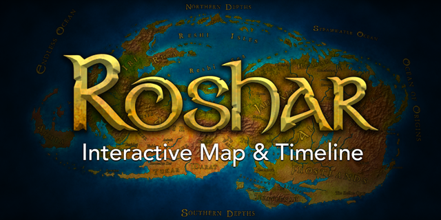

  

  
  
  
  

  An editor for the translation files used for interactive map and timeline of Roshar. Built using <a href="https://vuejs.org/">Vue.js</a> and <a href="https://electronjs.org/">Electron</a>.

## License

This project is licensed under the [MIT License](LICENSE). Please familiarize yourself with it if you wish to contribute.
